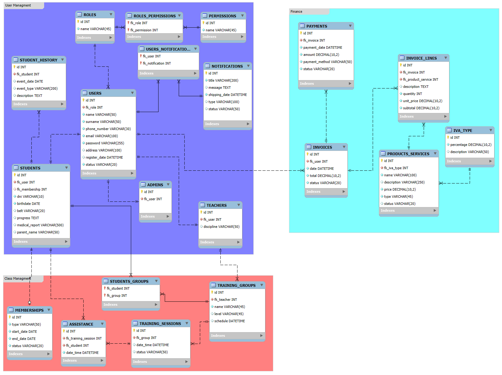

# MemberFlow-Data

## Diagrama Entidad-Relación

A continuación, se presenta el diagrama entidad-relación que describe la estructura de la base de datos del proyecto **MemberFlow-Data**. **Nota**: El diagrama debe ser actualizado para reflejar los cambios recientes en las relaciones y el uso de composición en lugar de herencia.

---

## Descripción del Proyecto

**MemberFlow-Data** es el módulo de acceso a datos y servicios de la aplicación **MemberFlow**, un sistema diseñado para la gestión de membresías, usuarios, clases y finanzas en un entorno organizacional. Este proyecto actúa como la capa de persistencia y lógica de negocio, proporcionando las entidades, configuraciones y servicios necesarios para interactuar con la base de datos.

El proyecto está diseñado para trabajar en conjunto con otro módulo llamado **MemberFlow-API**, que será responsable de exponer los controladores, manejar excepciones y proporcionar la interfaz de interacción con la web y otros clientes.

---

## Estructura del Proyecto

El proyecto está organizado en paquetes que agrupan las entidades, configuraciones, servicios y excepciones. A continuación, se detalla la estructura principal:

### 1. **Configuraciones**
- **`HibernateConfig`**: Configuración de Hibernate para la conexión y manejo de la base de datos.

### 2. **Entidades**
Las entidades representan las tablas de la base de datos y están organizadas en diferentes dominios:

#### a) **Gestión de Clases (`class_managment`)**
- **`Assistance`**: Representa la asistencia de un estudiante a una sesión de entrenamiento.
- **`Membership`**: Define las membresías de los estudiantes, incluyendo detalles como tipo, duración y beneficios.
- **`TrainingGroup`**: Representa un grupo de entrenamiento al que pueden pertenecer varios estudiantes y que está liderado por un profesor.
- **`TrainingSession`**: Define una sesión de entrenamiento específica, asociada a un grupo y con un horario determinado.

#### b) **Gestión de Usuarios (`user_managment`)**
- **`User`**: Representa un usuario genérico del sistema. Está asociado a roles, notificaciones y facturas.
- **`Student`**: Es un usuario con atributos específicos relacionados con su rol de estudiante, como historial, membresías y grupos de entrenamiento.
- **`Teacher`**: Es un usuario con atributos específicos relacionados con su rol de profesor, como los grupos que lidera.
- **`Admin`**: Es un usuario con permisos administrativos específicos.
- **`Notification`**: Representa notificaciones enviadas a los usuarios.
- **`Role`**: Define los roles de los usuarios (e.g., ADMIN, TEACHER, STUDENT).
- **`Permission`**: Define los permisos asociados a los roles.
- **`StudentHistory`**: Registra el historial de actividades de los estudiantes.

#### c) **Gestión Financiera (`finance`)**
- **`Invoice`**: Representa una factura generada para un usuario.
- **`InvoiceLine`**: Detalla los elementos de una factura.
- **`Payment`**: Registra los pagos realizados por los usuarios.
- **`ProductService`**: Define productos o servicios ofrecidos por la organización.
- **`IVAType`**: Define los tipos de IVA aplicables.

---

## Relaciones entre Entidades

A continuación, se describen las relaciones principales entre las entidades:

### 1. **Relaciones en Gestión de Clases (`class_managment`)**

#### a) **`Membership` ↔ `Student`**
- **Relación**: *Uno a Uno*.
- **Descripción**:
  - Cada estudiante tiene una única membresía activa.
  - Una membresía está asociada a un único estudiante.

#### b) **`TrainingGroup` ↔ `TrainingSession`**
- **Relación**: *Uno a Muchos*.
- **Descripción**:
  - Un grupo de entrenamiento puede tener múltiples sesiones asociadas.
  - Cada sesión pertenece a un único grupo.

#### c) **`TrainingSession` ↔ `Assistance`**
- **Relación**: *Uno a Muchos*.
- **Descripción**:
  - Una sesión de entrenamiento puede registrar múltiples asistencias.
  - Cada asistencia está asociada a un único estudiante y una única sesión.

#### d) **`TrainingGroup` ↔ `Student`**
- **Relación**: *Muchos a Muchos*.
- **Descripción**:
  - Un estudiante puede pertenecer a varios grupos de entrenamiento.
  - Un grupo puede tener múltiples estudiantes inscritos.

---

### 2. **Relaciones en Gestión de Usuarios (`user_managment`)**

#### a) **`User` ↔ `Role`**
- **Relación**: *Muchos a Uno*.
- **Descripción**:
  - Cada usuario tiene un rol asignado.
  - Un rol puede estar asociado a múltiples usuarios.

#### b) **`Role` ↔ `Permission`**
- **Relación**: *Muchos a Muchos*.
- **Descripción**:
  - Un rol puede tener múltiples permisos asociados.
  - Un permiso puede estar asociado a múltiples roles.

#### c) **`Student` ↔ `StudentHistory`**
- **Relación**: *Uno a Muchos*.
- **Descripción**:
  - Cada estudiante tiene un historial único que registra sus actividades.

#### d) **`Notification` ↔ `User`**
- **Relación**: *Muchos a Uno*.
- **Descripción**:
  - Un usuario puede recibir múltiples notificaciones.
  - Cada notificación está asociada a un único usuario.

#### e) **`User` ↔ `Student`, `Teacher`, `Admin`**
- **Relación**: *Uno a Uno* (por composición).
- **Descripción**:
  - Un usuario puede estar asociado a un estudiante, profesor o administrador.
  - Estas relaciones permiten extender los atributos específicos de cada tipo de usuario sin usar herencia directa.

---

### 3. **Relaciones en Gestión Financiera (`finance`)**

#### a) **`Invoice` ↔ `InvoiceLine`**
- **Relación**: *Uno a Muchos*.
- **Descripción**:
  - Una factura puede contener múltiples líneas de detalle.
  - Cada línea pertenece a una única factura.

#### b) **`Invoice` ↔ `Payment`**
- **Relación**: *Uno a Muchos*.
- **Descripción**:
  - Una factura puede estar asociada a múltiples pagos parciales.
  - Cada pago pertenece a una única factura.

#### c) **`ProductService` ↔ `InvoiceLine`**
- **Relación**: *Uno a Muchos*.
- **Descripción**:
  - Un producto o servicio puede aparecer en múltiples líneas de factura.
  - Cada línea de factura está asociada a un único producto o servicio.

#### d) **`ProductService` ↔ `IVAType`**
- **Relación**: *Muchos a Uno*.
- **Descripción**:
  - Un producto o servicio tiene un único tipo de IVA asociado.
  - Un tipo de IVA puede aplicarse a múltiples productos o servicios.

---

## Servicios Implementados

### Servicios de Gestión de Clases
- **`MembershipService`**: Proporciona lógica para gestionar las membresías de los estudiantes, incluyendo creación, actualización y cancelación.

### Servicios de Gestión de Usuarios
- **`AdminService`**: Gestiona las operaciones relacionadas con los administradores del sistema.
- **`NotificationService`**: Maneja el envío y la gestión de notificaciones para los usuarios.
- **`PermissionService`**: Administra los permisos asociados a los roles de los usuarios.
- **`RoleService`**: Gestiona los roles de los usuarios, incluyendo asignación y modificación.
- **`StudentHistoryService`**: Proporciona lógica para registrar y consultar el historial de actividades de los estudiantes.
- **`StudentService`**: Gestiona las operaciones relacionadas con los estudiantes, como inscripción y actualización de datos.
- **`TeacherService`**: Administra las operaciones relacionadas con los profesores, incluyendo asignación de grupos.
- **`UserService`**: Proporciona lógica general para la gestión de usuarios, como autenticación y actualización de perfiles.

### Servicios de Gestión Financiera

- **`InvoiceService`**: Gestiona la creación, modificación y validación de facturas. Calcula automáticamente el total con IVA y permite obtener facturas por usuario.

- **`InvoiceLineService`**: Administra las líneas de factura, que representan los ítems individuales facturados. Permite agregar o eliminar líneas dentro de una factura existente.

- **`PaymentService`**: Gestiona los pagos asociados a facturas. Soporta pagos parciales y actualiza el estado de la factura dependiendo del monto abonado.

- **`ProductServiceService`**: Controla la creación, actualización y eliminación de productos o servicios que pueden ser facturados. Cada producto se asocia con un tipo de IVA.

- **`IVATypeService`**: Administra los tipos de IVA disponibles, sus porcentajes y descripciones. Se utiliza para el cálculo fiscal en las líneas de factura.

